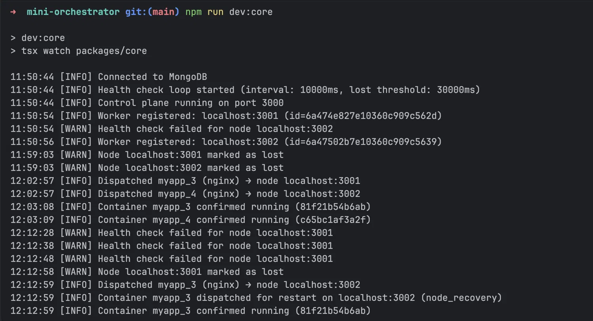
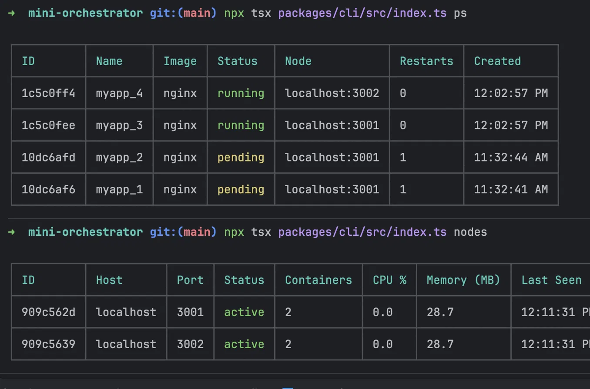

# mini-orchestrator

A lightweight container orchestration system built from scratch. It schedules Docker containers across a pool of worker nodes, tracks their state in MongoDB, and automatically restarts containers when they crash or their node goes offline — a minimal version of what Kubernetes does, without the complexity.

## Architecture

```
┌─────────────────────────────────────────────────────┐
│                      CLI                            │
│   deploy / ps / scale / kill / logs / nodes         │
└───────────────────────┬─────────────────────────────┘
                        │ HTTP
┌───────────────────────▼─────────────────────────────┐
│              Control Plane  (:3000)                 │
│                                                     │
│  ┌─────────────┐  ┌───────────┐  ┌───────────────┐  │
│  │  Scheduler  │  │ Health    │  │ Worker        │  │
│  │  (bin-pack) │  │ Loop      │  │ Registry      │  │
│  └─────────────┘  └───────────┘  └───────────────┘  │
│                        │                            │
│  ┌─────────────────────▼──────────────────────────┐ │
│  │                  MongoDB                       │ │
│  │     Nodes · Containers · Events                │ │
│  └────────────────────────────────────────────────┘ │
└──────────┬──────────────────┬───────────────────────┘
           │ HTTP             │ HTTP
  ┌────────▼──────┐  ┌────────▼──────┐
  │  Worker 1     │  │  Worker 2     │
  │  (:3001)      │  │  (:3002)      │
  │               │  │               │
  │  Docker sock  │  │  Docker sock  │
  └───────────────┘  └───────────────┘
```

## How it works

1. **Workers register** with the control plane on startup and send a heartbeat every 10 seconds with their container count and resource usage.
2. **Deploy** picks the worker with the fewest running containers (bin-packing), sends a fire-and-forget dispatch, and records the container as `pending` in MongoDB. No waiting for image pulls.
3. **Health loop** runs every 10 seconds on the control plane:
   - Promotes `pending` containers to `running` once the worker reports them by name.
   - Detects workers that stopped heartbeating and marks them `lost`.
   - Reschedules orphaned containers from lost nodes onto healthy ones.
   - Detects crashed containers on active nodes and restarts them (up to `MAX_RESTART_COUNT`).

## Getting started

### Prerequisites

- Node.js 18+
- Docker Desktop running
- A MongoDB Atlas cluster (or any MongoDB URI)

### Setup

```bash
# 1. Install dependencies
npm install

# 2. Create your .env
cp .env.example .env
# Fill in MONGODB_URI with your Atlas connection string
```

### Running locally

Open three terminals:

```bash
# Terminal 1 — control plane
npm run dev:core

# Terminal 2 — first worker
npm run dev:worker

# Terminal 3 — second worker (optional)
WORKER_PORT=3002 npm run dev:worker
```

The control plane boots, connects to MongoDB, and starts the health loop. Workers register themselves automatically on startup.



*The logs show two workers registering, a node going offline (`marked as lost`), and a container being automatically rescheduled to the surviving worker (`node_recovery`).*

## CLI usage

```bash
# Deploy 2 replicas of nginx
npx tsx packages/cli/src/index.ts deploy --image nginx --name myapp --replicas 2

# List all containers
npx tsx packages/cli/src/index.ts ps

# Scale to 4 replicas
npx tsx packages/cli/src/index.ts scale --name myapp --replicas 4

# Kill a container by ID
npx tsx packages/cli/src/index.ts kill <container-id>

# Tail live logs
npx tsx packages/cli/src/index.ts logs <container-id>

# List worker nodes
npx tsx packages/cli/src/index.ts nodes
```



*`ps` shows container status across nodes — `pending` means the image is still being pulled, `running` means the health loop has confirmed it. `nodes` shows live CPU, memory, and container counts per worker.*

### CLI options

| Command | Key flags | Description |
|---|---|---|
| `deploy` | `--image`, `--name`, `--replicas` | Deploy one or more containers |
| `ps` | `--status`, `--group` | List containers (filterable) |
| `scale` | `--name`, `--replicas` | Scale a group up or down |
| `kill` | `<id>` | Stop and remove a container |
| `logs` | `<id>` | Stream live container logs |
| `nodes` | — | List worker nodes and their load |

All commands accept `--host <url>` to override the control plane URL, or set `ORCHESTRATOR_URL` in `.env`.

## Configuration

All options are set via environment variables (see `.env.example`):

| Variable | Default | Description |
|---|---|---|
| `MONGODB_URI` | — | MongoDB connection string (required) |
| `PORT` | `3000` | Control plane port |
| `HEALTH_CHECK_INTERVAL_MS` | `10000` | How often the health loop runs |
| `NODE_LOST_THRESHOLD_MS` | `30000` | Heartbeat silence before a node is marked lost |
| `MAX_RESTART_COUNT` | `5` | Max auto-restarts before a container is marked dead |
| `WORKER_PORT` | `3001` | Port the worker listens on |
| `WORKER_HOST` | `localhost` | Hostname the control plane uses to reach this worker |
| `CONTROL_PLANE_URL` | `http://localhost:3000` | Worker → control plane address |

## Docker Compose

To run everything in containers instead:

```bash
# Add MONGODB_URI to your .env, then:
docker compose up --build
```

This starts one control plane and two workers. Workers wait for the control plane healthcheck before registering.

## Project structure

```
packages/
  core/       Control plane (Express + Mongoose)
    src/
      api/          REST handlers (deploy, scale, kill, logs, metrics, nodes)
      db/models/    Mongoose schemas (Container, Node, Event)
      scheduler/    Node picker + HTTP dispatch to workers
      health/       Health loop (crash recovery, node recovery)
      worker-registry/  Heartbeat + registration handlers

  worker/     Worker node (Express + Dockerode)
    src/
      api/          REST handlers (run, kill, logs, stats, health)
      docker/       Dockerode wrappers (pull, run, kill, stats)
      heartbeat/    Periodic heartbeat to control plane

  cli/        Command-line interface (Commander + Chalk)
    src/
      commands/     deploy, ps, kill, scale, nodes, logs
```
